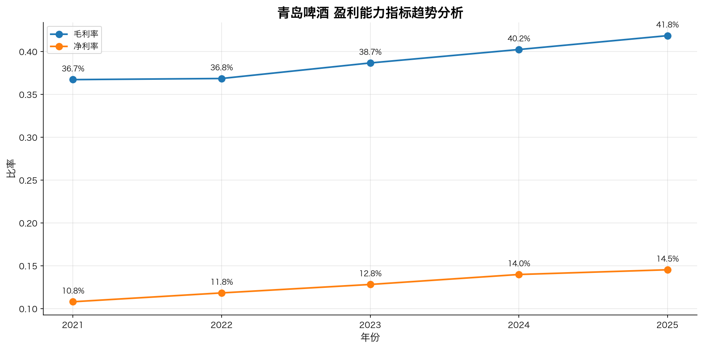
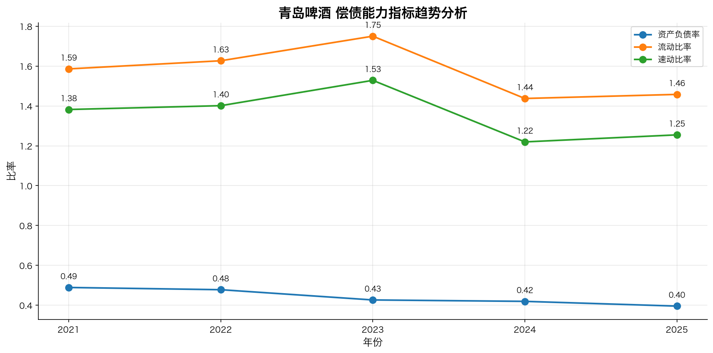
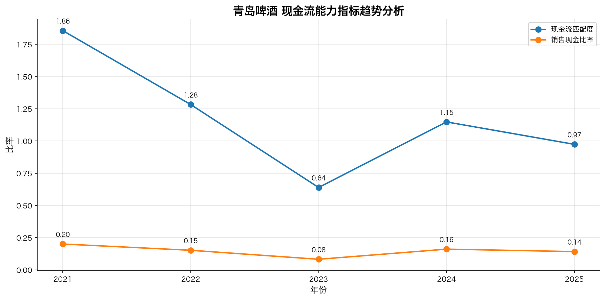

# 青岛啤酒财务指标趋势分析报告

分析期间: 2021 - 2025
股票代码: 600600

## 一、盈利能力指标趋势

盈利能力反映公司通过经营获取利润的能力。以下分析基于图表数据。

## 二、偿债能力指标趋势

偿债能力反映公司偿还短期和长期债务的能力。以下分析基于图表数据。

## 三、运营能力指标趋势

运营能力反映公司利用资产创造收入的效率。以下分析基于图表数据。

## 四、现金流能力指标趋势

现金流能力反映公司经营活动产生现金的能力。以下分析基于图表数据。

## 五、数据来源
- 数据来源: 东方财富-数据中心-年报季报-业绩快报
- 数据加工: financial_ratio_calculation skill