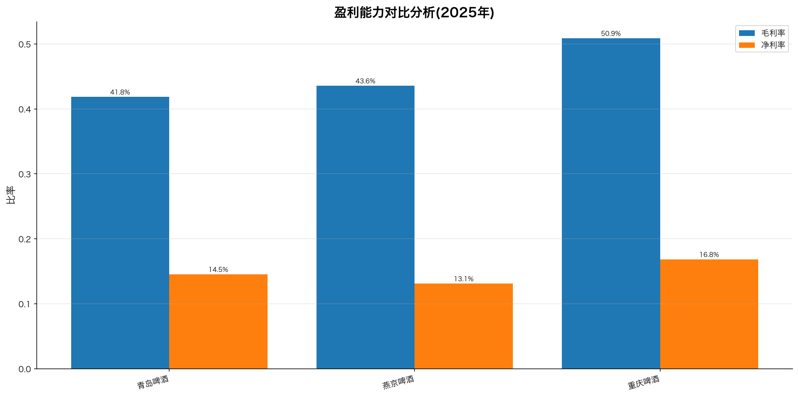
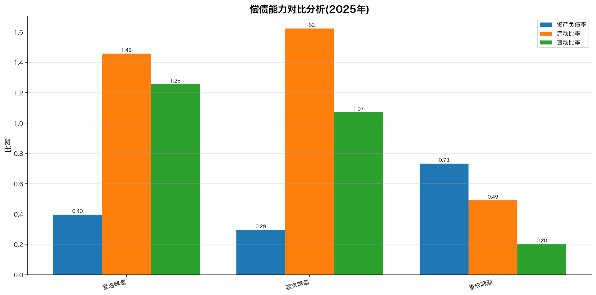

# 青岛啤酒与竞争对手财务指标对比分析报告

对比年份: 2025
目标公司: 青岛啤酒 (600600)
对比公司: 燕京啤酒, 重庆啤酒

## 一、盈利能力对比

盈利能力反映公司通过经营获取利润的能力。以下分析基于图表数据。

## 二、偿债能力对比

偿债能力反映公司偿还短期和长期债务的能力。以下分析基于图表数据。

## 三、运营能力对比

运营能力反映公司利用资产创造收入的效率。以下分析基于图表数据。

## 四、现金流能力对比

现金流能力反映公司经营活动产生现金的能力。以下分析基于图表数据。

## 五、数据来源
- 数据来源: 东方财富-数据中心-年报季报-业绩快报
- 数据加工: financial_ratio_calculation skill