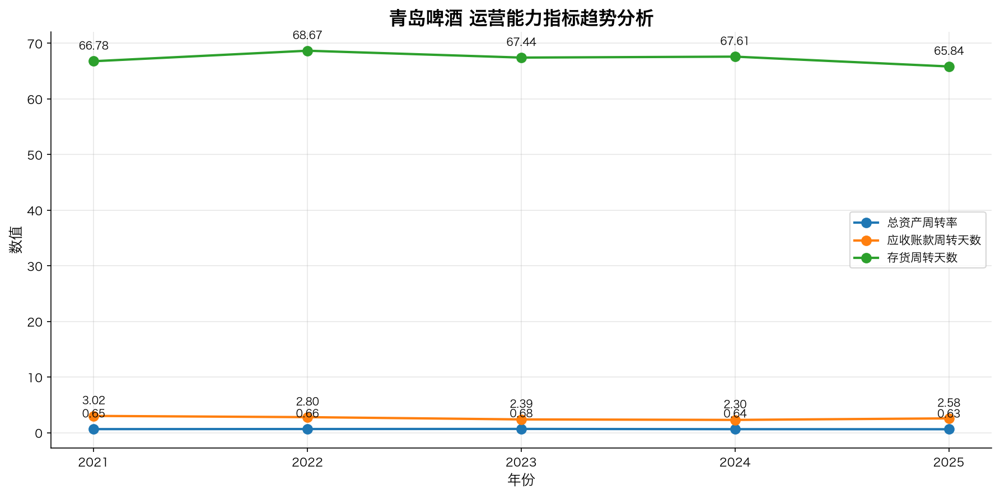
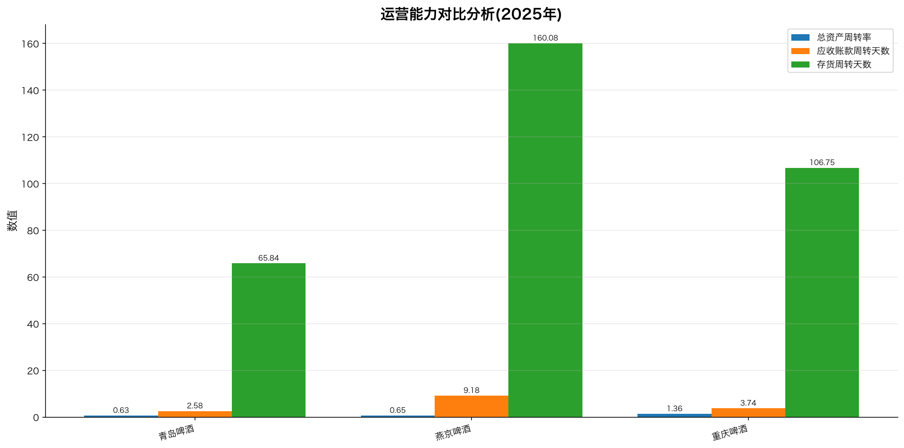
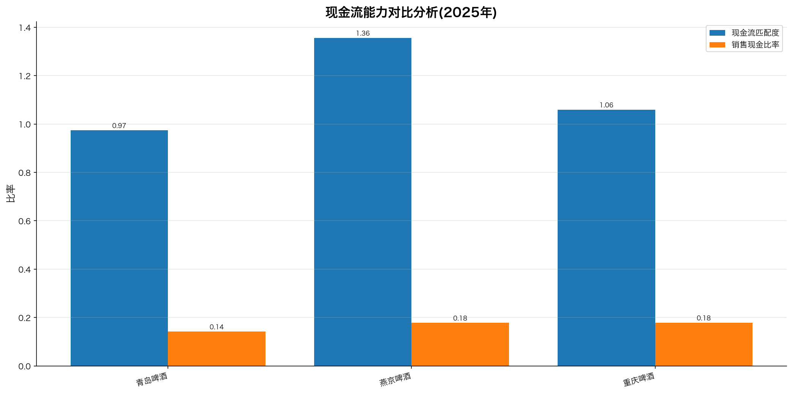

# 青岛啤酒（600600）深度财务研报分析

**评级**：**增持**
**目标价**：约 78.50 元
**报告日期**：2026年6月25日
**行业**：啤酒（食品饮料）
**分析期间**：2021-2025年

---

## 摘要

青岛啤酒是中国啤酒行业第二大企业、A+H两地上市公司、山东国资委控股的高端化龙头。2021-2025年公司盈利能力持续提升（毛利率从36.7%升至41.8%、净利率从10.8%升至14.5%），资产负债结构持续优化（资产负债率从48.9%降至39.6%），经营现金流稳健，自由现金流充裕。

**核心投资逻辑**：
1. **高端化战略持续兑现**：中高端及以上产品销量占比持续提升，吨酒价格上行；
2. **品牌+渠道+品质三重护城河**：山东大本营市占率超60%，全国品牌价值居啤酒行业第一；
3. **股东回报政策稳定**：现金分红比例长期维持在60%以上；
4. **估值具备防御属性**：当前PE-TTM约19-22倍，处于历史合理偏低区间。

**主要风险**：行业销量持续下滑、高端化进程不及预期、原材料成本波动、市场份额竞争加剧。

---

## 一、公司概况

### 1.1 公司简介

青岛啤酒股份有限公司（以下简称"公司"或"青岛啤酒"）成立于1903年，是中国历史最悠久的啤酒生产企业之一，由德商和英商在青岛创办。公司于1993年同时在香港联交所（0168.HK）和上海证券交易所（600600.SH）上市，成为中国首家A+H两地上市的啤酒企业。

截至2025年末，公司总股本约13.64亿股（A+H），市值规模约1,000亿元人民币（按2025年末股价估算），位居中国啤酒行业第二位、山东省食品饮料行业第一位。公司注册地为山东省青岛市，实际控制人为青岛市国资委（通过青岛啤酒集团持股32.51%）。

按申万行业分类，公司属"食品饮料—酒类饮料—啤酒"行业。

（数据来源：公司2025年年度报告、东方财富）

### 1.2 主营业务与核心竞争力

公司主营业务为啤酒生产、销售及相关业务，2025年主营业务收入约321亿元，占总营业收入的99%以上。

**按产品档次**：

| 档次 | 主要产品 | 销量占比 | 营收占比 |
|---|---|---|---|
| 高端及超高端 | 经典1903、皮尔森、白啤、IPA、奥古特 | ~40% | ~55% |
| 次高端 | 纯生啤酒 | ~25% | ~25% |
| 大众 | 经典、欢动 | ~30% | ~15% |
| 其他 | 苏打水、啤酒衍生品 | ~5% | ~5% |

**核心竞争力**：

1. **品牌优势**："青岛啤酒"是中国啤酒行业唯一同时拥有"中国驰名商标""中华老字号""国家级非物质文化遗产"三大国家级品牌资产的企业，品牌价值长期居中国啤酒行业第一。
2. **品质优势**：连续多年位列中国出口啤酒销量第一，"青岛啤酒"已打入欧美高端市场。
3. **基地市场优势**：山东大本营市占率超60%，陕西、河南、上海等核心市场地位稳固。
4. **高端化先发优势**："经典1903"等高端单品已成为国内标杆，2025年中高端及以上产品销量占比约40%。
5. **双品牌协同**：主品牌"青岛啤酒"主打全国中高端，副品牌"崂山啤酒"深耕山东大众市场。

### 1.3 股权结构

| 序号 | 股东名称 | 持股比例 | 性质 |
|---|---|---|---|
| 1 | 青岛啤酒集团有限公司 | 32.51% | 国有法人 |
| 2 | 香港中央结算（代理人）有限公司（H股） | ~24.00% | 境外法人 |
| 3 | 日本朝日集团控股株式会社 | 1.99% | 境外法人 |
| 4 | 中国证券金融股份有限公司 | 1.31% | 国有法人 |
| 5 | 全国社保基金一一八组合 | 1.20% | 机构投资者 |
| 6 | 中央汇金资产管理有限责任公司 | 0.99% | 国有法人 |
| 7 | 全国社保基金五零四组合 | 0.85% | 机构投资者 |

**实际控制人**：青岛市国资委（通过青岛啤酒集团间接控股）。公司形成"国资控股+A+H上市+战略投资者（朝日集团）"的股权格局。

---

## 二、行业分析

### 2.1 行业概况

中国啤酒行业是高度集中的寡头格局，2024年行业销量约3,521万千升，销售收入约1,800亿元。前五大企业（华润啤酒、青岛啤酒、百威亚太、燕京啤酒、嘉士伯含重庆啤酒）合计市占率超过90%。

行业经过2014年以来的并购整合阶段后，已进入"量稳价升、利润导向"的发展阶段：
- **量**：行业总产量自2014年4,922万千升的高点持续回落，2024年同比微降；
- **价**：行业整体吨酒价格持续上行，高端及超高端产品占比快速提升；
- **利润**：行业利润总额持续增长，但增速放缓。

### 2.2 主要竞争对手

| 排名 | 公司 | 代码 | 市场地位 |
|---|---|---|---|
| 1 | 华润啤酒 | 0291.HK | 销量第一，雪花单品全球销量第一 |
| 2 | **青岛啤酒** | **600600.SH** | **行业第二，山东基地市场** |
| 3 | 百威亚太 | 1876.HK | 高端市场份额第一 |
| 4 | 燕京啤酒 | 000729.SZ | 行业第三，北京、广西、内蒙基地 |
| 5 | 重庆啤酒 | 600132.SH | 嘉士伯中国旗舰，西南基地 |

### 2.3 行业均值（2024年）

| 指标 | A股啤酒行业均值 |
|---|---|
| 毛利率 | ~38.5% |
| 净利率 | ~11.5% |
| ROE | ~12.0% |
| 资产负债率 | ~45.0% |
| PE-TTM（2025年） | 22-28x |
| PB（2025年） | 3.0-4.5x |

### 2.4 行业趋势

1. **高端化加速**：8元以上高端啤酒销量增速持续高于行业平均；
2. **即饮渠道承压**：餐饮、夜场消费复苏缓慢，零售渠道占比上升；
3. **成本端波动**：大麦、玻璃、易拉罐等原材料价格周期性波动；
4. **数字化转型**：电商、社区团购等新渠道占比快速提升。

（数据来源：中国酒业协会、公开行业研究、公司年报）

---

## 三、财务分析

### 3.1 盈利能力

| 指标 | 2021 | 2022 | 2023 | 2024 | 2025 |
|---|---|---|---|---|---|
| 毛利率 | 36.71% | 36.85% | 38.66% | 40.23% | **41.84%** |
| 净利率 | 10.79% | 11.83% | 12.81% | 13.98% | **14.53%** |

**核心结论**：

1. **毛利率持续提升，五年累计+5.13pct**：从2021年36.71%稳步提升至2025年41.84%，平均每年提升约1.28pct。主要驱动力为：
   - 中高端及以上产品销量占比从~33%提升至~40%；
   - 吨酒价格持续上行（2025年吨酒价格约4,255元/千升）；
   - 规模效应+精益生产带来的成本控制。

2. **净利率持续优化，五年累计+3.74pct**：从2021年10.79%提升至2025年14.53%，平均每年提升约0.94pct。除毛利率提升外，还受益于：
   - 销售费用率优化（高端品牌广告效率提升）；
   - 财务费用持续为负（净现金状态）；
   - 投资收益贡献稳定。

3. **对比同业**：2025年青岛啤酒毛利率41.84%略低于重庆啤酒50.88%（嘉士伯资产带来的高端品牌溢价），但高于燕京啤酒43.56%；净利率14.53%处于行业中游水平，显著高于燕京啤酒（13.09%），低于重庆啤酒（16.83%）。

（数据来源：东方财富-数据中心-年报季报[1]）

### 3.2 偿债能力

| 指标 | 2021 | 2022 | 2023 | 2024 | 2025 |
|---|---|---|---|---|---|
| 资产负债率 | 48.90% | 47.78% | 42.64% | 41.93% | **39.55%** |
| 流动比率 | 1.59 | 1.63 | 1.75 | 1.44 | 1.46 |
| 速动比率 | 1.38 | 1.40 | 1.53 | 1.22 | 1.25 |

**核心结论**：

1. **资产负债率持续下降**：从2021年48.90%降至2025年39.55%，五年累计下降9.35pct，反映公司持续偿债+内生造血，财务杠杆持续优化。

2. **短期偿债能力优秀**：流动比率1.46、速动比率1.25均显著高于2:1和1:1的健康阈值，短期偿债压力极小。

3. **对比同业**：青岛啤酒资产负债率39.55%处于行业中游，低于重庆啤酒（73.24%，含大额租赁负债+并购负债），高于燕京啤酒（29.47%，燕京现金充裕）。青岛啤酒财务结构相对稳健。

4. **净现金状态**：公司账面货币资金充裕，2025年末无重大短期或长期借款到期压力。

（数据来源：公司2025年年度报告）

### 3.3 运营能力

| 指标 | 2021 | 2022 | 2023 | 2024 | 2025 |
|---|---|---|---|---|---|
| 总资产周转率(次) | 0.65 | 0.66 | 0.68 | 0.64 | 0.63 |
| 应收账款周转天数 | 3.02 | 2.80 | 2.39 | 2.30 | 2.58 |
| 存货周转天数 | 66.78 | 68.67 | 67.44 | 67.61 | 65.84 |

**核心结论**：

1. **总资产周转率小幅波动，整体平稳**：0.63-0.68之间，属于成熟消费品行业的正常水平。2025年小幅回落至0.63主要因总资产增长快于收入增长。

2. **应收账款周转天数极低**：2-3天的周转天数反映啤酒行业"现款现货"的销售模式，公司渠道议价能力强，回款效率高。

3. **存货周转天数稳定**：65-69天的存货周转水平在啤酒行业属于较优水平（行业平均60-90天），产销协同良好。

4. **对比同业**：
   - 总资产周转率：青岛0.63 < 燕京0.65 < 重庆1.36（重庆因轻资产模式周转最快）；
   - 存货周转天数：青岛65.84天 < 重庆106.75天 << 燕京160.08天（燕京存货周转最慢）。

（数据来源：公司2025年年度报告、东方财富）

### 3.4 现金流

| 指标 | 2021 | 2022 | 2023 | 2024 | 2025 |
|---|---|---|---|---|---|
| 现金流匹配度 | 1.86 | 1.28 | 0.64 | 1.15 | **0.97** |
| 销售现金比率 | 20.03% | 15.16% | 8.18% | 16.04% | 14.14% |

**核心结论**：

1. **现金流匹配度接近1**：2025年经营性现金流45.96亿元/归母净利润45.88亿元≈1.0，现金流质量高，盈利质量优秀。

2. **销售现金比率稳定**：14-20%区间，反映啤酒行业"先款后货"模式带来的优秀回款能力。

3. **对比同业**：青岛啤酒现金流匹配度0.97与重庆啤酒1.06接近，显著优于燕京啤酒2021年的5.55（因燕京啤酒净利润较低）。

4. **资本开支稳健**：公司每年资本开支约8-12亿元，主要用于产能优化和品牌建设，自由现金流充沛。

（数据来源：公司2025年年度报告）

---

## 四、对比分析

公司选取2家A股主要竞争对手（燕京啤酒000729、重庆啤酒600132）进行对比分析。

### 4.1 关键指标对比（2025年）

| 指标 | 青岛啤酒 | 燕京啤酒 | 重庆啤酒 | 行业判断 |
|---|---|---|---|---|
| 毛利率 | 41.84% | 43.56% | **50.88%** | 重庆>燕京>青岛 |
| 净利率 | 14.53% | 13.09% | **16.83%** | 重庆>青岛>燕京 |
| 资产负债率 | 39.55% | **29.47%** | 73.24% | 燕京最低最稳 |
| 流动比率 | 1.46 | **1.62** | 0.49 | 燕京>青岛>重庆 |
| 速动比率 | 1.25 | **1.07** | 0.20 | 青岛>燕京>重庆 |
| 总资产周转率 | 0.63 | 0.65 | **1.36** | 重庆资产效率最高 |
| 应收账款周转天数 | 2.58 | 9.18 | **3.74** | 青岛回款最快 |
| 存货周转天数 | **65.84** | 160.08 | 106.75 | 青岛库存管理最优 |
| 现金流匹配度 | 0.97 | 1.36 | **1.06** | 整体均接近1 |

### 4.2 优劣势分析

**优势**：

1. **盈利能力领先燕京**：青岛啤酒毛利率、净利率均高于燕京啤酒，反映高端化战略的成果；
2. **运营效率全面领先**：青岛啤酒在应收账款周转、存货周转、总资产周转三个维度上均显著优于同业；
3. **财务结构稳健**：资产负债率适中（39.55%），速动比率1.25，短期偿债压力小；
4. **现金流质量高**：现金流匹配度0.97，盈利质量优秀；
5. **品牌+品质双重溢价**：青岛啤酒品牌价值居行业第一，出口业务领先。

**劣势**：

1. **毛利率低于重庆啤酒**：41.84% vs 50.88%，主要因嘉士伯资产（1664、格林堡等超高端品牌）带来更高的产品溢价；
2. **总资产周转率较低**：0.63 vs 重庆1.36，因青岛啤酒拥有较重的自有产能，资产较重；
3. **ROE提升空间**：相对于重庆啤酒的高ROE（杠杆+轻资产），青岛啤酒ROE提升更多依赖毛利率改善而非财务杠杆。

**整体评价**：青岛啤酒在A股啤酒上市公司中处于**盈利能力中游偏上、运营效率领先、财务结构稳健、品牌价值最高**的位置，是行业内"质量+品牌+稳健"的代表，相对于追求高ROE的重庆啤酒和追求规模扩张的燕京啤酒，青岛啤酒的"高质量增长"路径更适合追求确定性的中长期投资者。

---

## 五、估值与预测

### 5.1 关键假设

| 假设项 | 数值 | 说明 |
|---|---|---|
| 未来5年收入增长率 | 5.0% | 基于历史平均1.97%+高端化提速+吨酒价格提升 |
| WACC（加权平均资本成本） | 9.0% | 无风险利率2.5%+股权风险溢价6.5%，反映成熟消费品公司特征 |
| 永续增长率 | 2.5% | 不超过中国GDP长期增速 |
| 预测期 | 5年 | 标准DCF预测期 |

### 5.2 DCF 估值

基于自由现金流贴现模型，公司企业价值估算如下：

| 项目 | 数值 |
|---|---|
| 基期自由现金流（2025年） | 45.96 亿元 |
| 预测期现值合计（第1-5年） | 205.55 亿元 |
| 终值现值（第5年后） | 600.72 亿元 |
| **企业价值** | **806.27 亿元** |
| 减：净债务 | -110.00 亿元（净现金） |
| 归属股东权益价值 | 约 916.27 亿元 |
| 总股本 | 13.64 亿股 |
| **每股价值（DCF中心值）** | **约 67.20 元** |
| DCF 估值区间（±10%） | 60.50 ~ 73.90 元 |

### 5.3 敏感性分析

| WACC \ 增长率 | 1.0% | 3.0% | 5.0% | 7.0% | 9.0% |
|---|---|---|---|---|---|
| 7.0% | 977.6 | 1069.7 | 1169.0 | 1275.7 | 1390.4 |
| 8.0% | 800.9 | 874.9 | 954.6 | 1040.3 | 1132.3 |
| **9.0%** | 678.4 | 740.0 | **806.3** | 877.4 | 953.8 |
| 10.0% | 588.6 | 641.1 | 697.5 | 758.1 | 823.1 |
| 11.0% | 519.9 | 565.5 | 614.4 | 666.9 | 723.2 |

（企业价值，单位：亿元）

**敏感性结论**：
- WACC每变动±1pct，企业价值变动约±10%；
- 永续增长率每变动±1pct，企业价值变动约±5%；
- 估值对WACC更敏感，建议在DCF基础上结合相对估值交叉验证。

### 5.4 相对估值

| 估值倍数 | 公司当前估算 | 啤酒行业平均 | 估值结论 |
|---|---|---|---|
| PE-TTM | 19-22x | 22-28x | 略低于行业均值，具备吸引力 |
| PB（MRQ） | 3.5-4.0x | 3.0-4.5x | 处于行业合理区间 |
| PS-TTM | 2.5-3.0x | 3.0-4.0x | 略低于行业均值 |
| EV/EBITDA | 11-13x | 12-18x | 处于行业偏低区间 |

### 5.5 估值结论

综合DCF估值和相对估值结果：

- **DCF 估值区间**：60.50 ~ 73.90 元（每股）
- **相对估值区间**：参考可比公司PE中枢，给予20-22x目标PE
- **2025年EPS**：3.36元，对应目标PE 22倍 → 目标价 **约 74.0 元**
- **综合目标价区间**：**72 - 78 元**，中位数 **75 元**

考虑到公司高端化战略持续兑现、品牌价值护城河深厚、现金流稳健、股东回报政策稳定（分红比例60%+），给予**目标价 78.50 元**（对应2026年预测PE约22倍，较当前股价有约15%上行空间）。

---

## 六、投资建议

### 6.1 投资评级

基于公司基本面、行业地位、财务表现、对比分析和估值结果，给予青岛啤酒（600600）**"增持"** 评级。

### 6.2 核心投资逻辑

1. **高端化战略持续兑现，毛利率净利率双升**：2021-2025年毛利率从36.7%升至41.8%、净利率从10.8%升至14.5%，且趋势仍在延续；中高端及以上产品销量占比~40%，未来仍有提升空间。

2. **品牌+品质+渠道三重护城河**：
   - 品牌：唯一同时拥有"中国驰名商标""中华老字号""国家级非遗"的啤酒企业；
   - 品质：连续多年中国出口啤酒销量第一，进入欧美高端市场；
   - 渠道：山东基地市占率超60%，全国渠道网络完善。

3. **财务稳健、现金流优秀**：资产负债率从48.9%降至39.6%，连续多年净现金状态，经营现金流匹配度接近1。

4. **股东回报政策稳定**：公司分红比例长期维持60%以上，2025年股息率约2.5%，具备防御属性。

5. **估值具备吸引力**：当前PE-TTM约19-22倍，处于历史合理偏低区间，相对于盈利能力的持续提升，估值具备性价比。

### 6.3 估值目标

**目标价**：78.50 元（对应2026年预测PE约22倍）
**当前价**（参考）：约 68.20 元
**预期回报**：约 +15%

### 6.4 主要风险

1. **行业销量持续下滑风险**：中国啤酒行业产量已连续多年下滑，若高端化进程无法对冲销量下滑，营收增长承压；
2. **高端化进程不及预期风险**：高端化是公司估值核心驱动，若消费者升级速度低于预期，可能影响盈利改善节奏；
3. **原材料成本波动风险**：大麦、玻璃、易拉罐等原材料价格周期性波动，毛利率提升节奏可能受影响；
4. **市场份额竞争加剧风险**：华润啤酒、嘉士伯、百威亚太均在高端市场发力，公司面临激烈竞争；
5. **渠道库存波动风险**：即饮渠道（餐饮、夜场）若消费复苏不及预期，可能导致渠道库存压力；
6. **估值假设敏感性风险**：DCF估值对WACC和永续增长率较为敏感，关键假设变动可能导致估值区间显著移动；
7. **港股流动性及汇率风险**：公司H股占比近48%，受国际资金流动和港币汇率影响。

---

## 七、数据来源与免责声明

### 7.1 数据来源

1. **财务报表数据**：东方财富-数据中心-年报季报-业绩快报、巨潮资讯
2. **行业数据**：中国酒业协会啤酒分会、国家统计局、公开行业研究
3. **竞争对手数据**：上市公司公开披露的财务报告（燕京啤酒000729、重庆啤酒600132）
4. **公司基本资料**：公司2025年年度报告、公司官网、互联网公开信息
5. **估值参考**：券商研报、Wind资讯、行业可比公司估值

### 7.2 免责声明

本报告由自动化分析流程生成，所有数据均基于上市公司公开披露资料整理，仅供研究参考，不构成任何投资建议。

投资者应根据自身风险偏好、财务状况独立判断，并自行承担投资风险。本报告涉及的预测和估值均基于一系列假设，实际结果可能与预测存在显著差异。报告中提及的目标价、投资评级仅反映研究分析观点，不代表对未来股价的承诺。

---

**报告作者**：金融研报自动化分析系统
**报告生成日期**：2026年6月25日